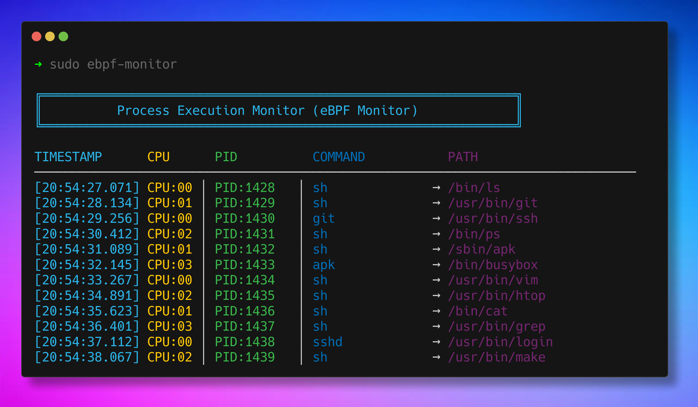

<div align="center">

# ebpf-monitor ⚡

**A real-time process execution monitor using eBPF and Go**

Watch every program execution on your Linux system with zero overhead.  
**ebpf-monitor** uses kernel tracepoints to capture execve syscalls in real-time.

[](https://go.dev/)
[](LICENSE)
[](https://ebpf.io/)
[](https://github.com/ackreq/ebpf-monitor/pulls)



</div>

## Features

- 🚀 **Real-time monitoring:** See process executions as they happen
- 🎨 **Beautiful output:** Color-coded terminal display with timestamps
- ⚡ **Near-zero overhead:** eBPF runs in kernel space
- 🔒 **Kernel-verified:** Safe execution validated by eBPF verifier
- 📊 **Rich details:** Captures PID, CPU, command name, and full path

## Prerequisites

- **Linux kernel** ≥ 4.15 (≥ 5.11 recommended)
- **Go** ≥ 1.21
- **clang**
- **Make**
- **bpftool**

```sh
# Ubuntu-based distributions
sudo apt update
sudo apt install make clang llvm bpftool linux-tools-common linux-tools-generic

# Arch-based distributions
pacman -Syu clang make go bpf llvm
```

## Installation

```bash
# Clone the repository
git clone https://github.com/ackreq/ebpf-monitor.git
cd ebpf-monitor

# Build the binary
make build

# Run (requires sudo)
sudo make run
```

Press `Ctrl+C` to stop monitoring.

## How It Works

1. eBPF program loads into kernel and attaches to `sys_enter_execve`
2. Every `execve` syscall triggers data capture
3. Data flows through perf event array to user-space
4. Go program decodes and displays with colors

> [!TIP]
> These are some useful documents I came along to learn more about eBPF:
>
> - [eBPF Official Docs](https://ebpf.io/)
> - [cilium/ebpf Library](https://ebpf-go.dev/guides/getting-started/)
> - [Linux Tracepoints](https://www.kernel.org/doc/html/latest/trace/tracepoints.html)

## Project Structure

```
ebpf-monitor/
├── execve.bpf.c         # eBPF kernel program (C)
├── main.go              # User-space monitor (Go)
├── go.mod               # Go dependencies
└── Makefile             # Build automation
```

## 🌱 Contributing

Contributions are welcome! Whether you're fixing bugs, adding features, or improving docs, your help is appreciated. Please open an issue or submit a pull request.
